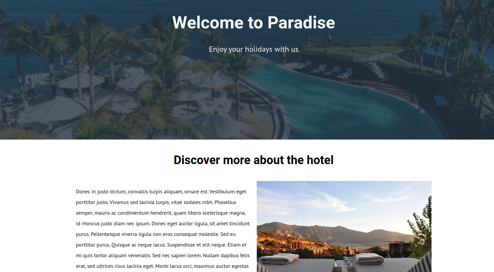
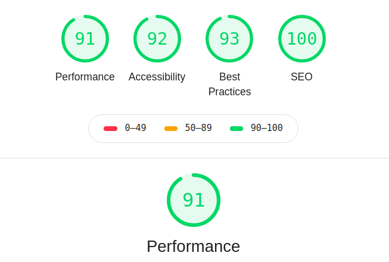

# Paradise Hotel



## Introduction

Paradise Hotel is a simple hotel website developed with server-side rendering with Gatsby. The only purpose of the project was to learn Gatsby and try to improve SEO and performance in a website. As you can see, the audits are so hight!



You can run the deployed project here: https://paradise-hotel.netlify.com/

## Technical Description

Backend (server-side rendering): Gatsby with GraphQL and DatoCMS

## Usage

**Prerequisites:**

- Install Node.js if you haven't yet (https://nodejs.org/es/). Npm is needed but is included installing Node.js.

**Next steps:**

- Download or clone the repository in your local (https://github.com/diana-moreno/paradise-hotel.git).

- Install dependencies running the command:
  ```
  npm i
  ```

**Running:**

- Open in your localhost the project:
  ```
  npm run start
  ```
  Your site is now running at `http://localhost:8000`!

  _Note: You'll also see a second link: _`http://localhost:8000/___graphql`_. This is a tool you can use to experiment with querying your data. Learn more about using this tool in the [Gatsby tutorial](https://www.gatsbyjs.org/tutorial/part-five/#introducing-graphiql)._

**Optional**

- If you want to make some changes, you can see a preview of production with the following command:
  ```
  npm run serve
  ```
  Your site is now running at `http://localhost:9000`!